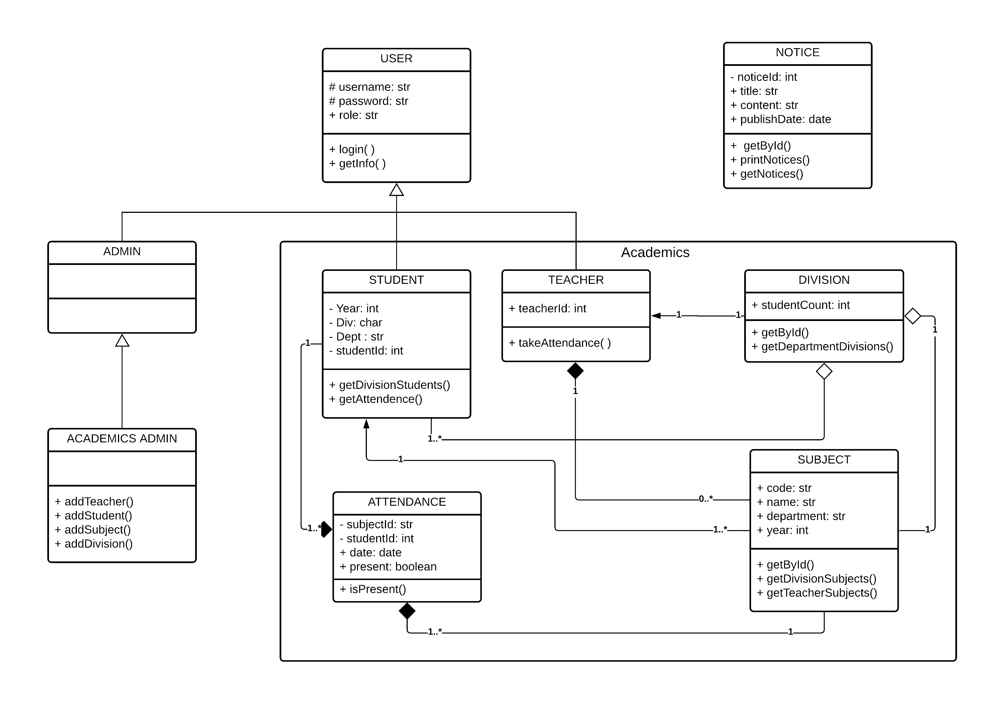
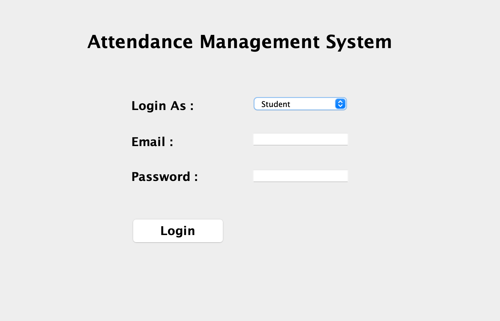
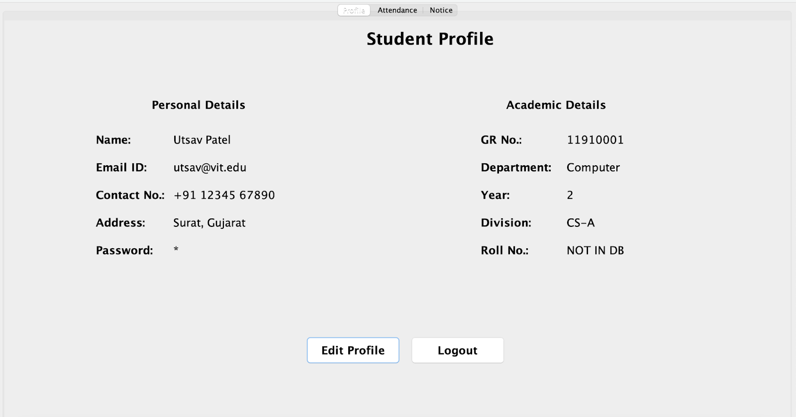
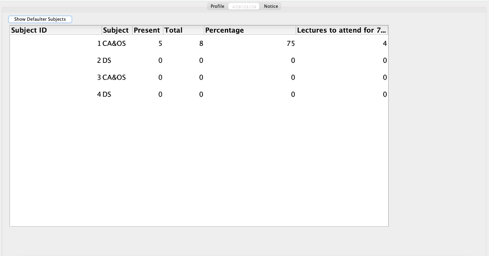
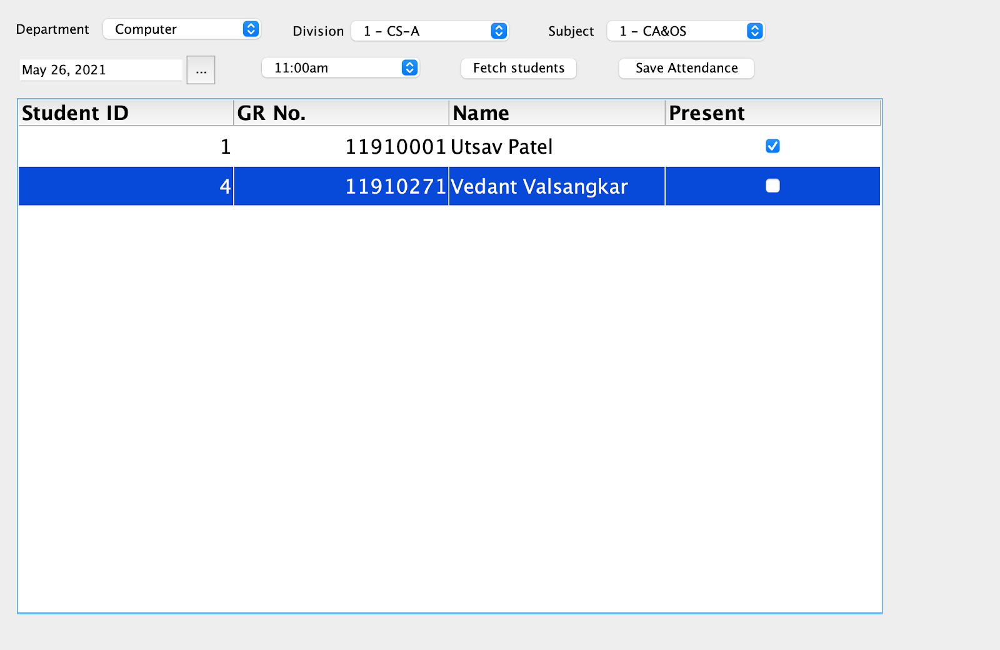
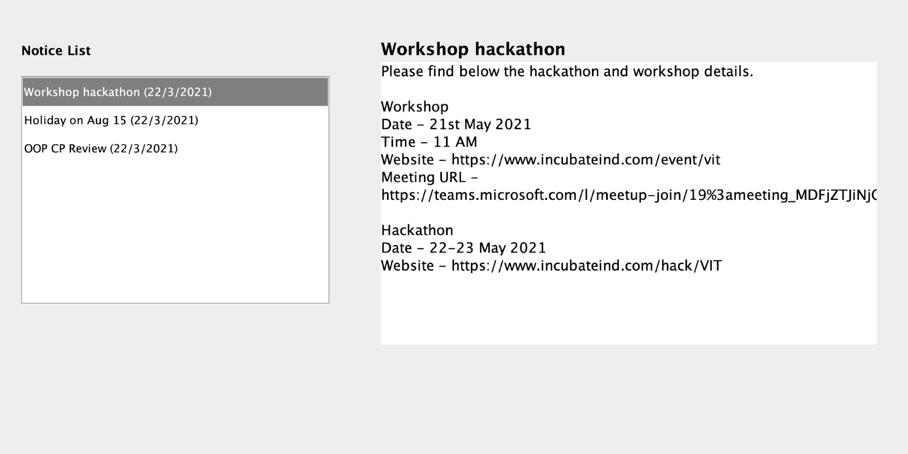

# AttendanceManagementSystem

> GUI application to help administrators and teachers with student attendance, notice management, etc.

### Built using
- Swing (Java)
- PostgreSQL

## Screenshots
\

_UML class diagram_ \
\
\

_Log in page where the user can login using their email and password_ \
\
\

_Profile page where the student/teacher to view and edit their details_ \
\
\

_GUI for **students** to view their attendance for different subjects and also filter out their defaulter subjects_ \
\
\

_GUI for **teachers** to add student attendance for their subjects according to date and time of the lecture._ \
\
\

_Notice page where students and teachers can view current and previous notices._

